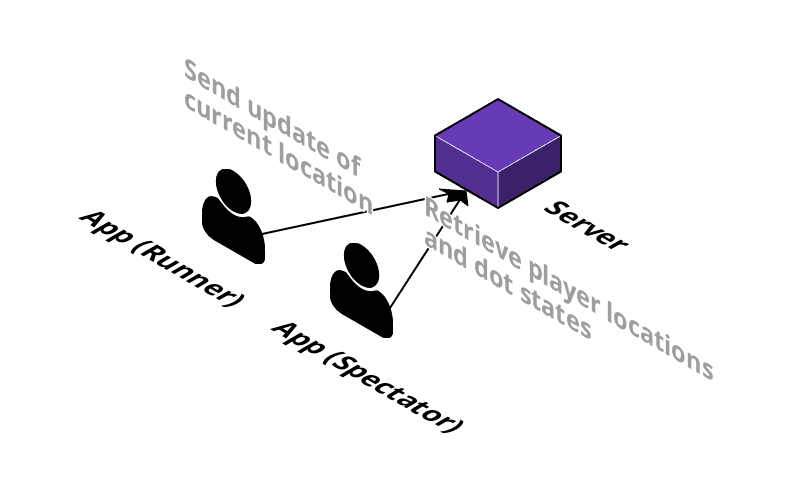

# Pac Macro Mobile Application (Android)

[](https://github.com/pacmacro/pm-android/blob/master/LICENSE)

Android mobile application for playing the game Pac Macro.  
The game can be downloaded from the Google Play Store [here](https://play.google.com/store/apps/details?id=ca.sfu.pacmacro).  
The official specification for the game can be found [here](https://github.com/pacmacro/pm-specification).

[](https://cloudcraft.co/view/e364e7e3-cdc5-48e8-9b5f-82d7ba0d95a6?key=BhmvffJBoBU73zAUh8X22A&embed=true)

## Setup

Install [Android Studio](https://developer.android.com/studio/) and clone the project to your local machine:
```shell
git clone https://github.com/pacmacro/pm-android
```

### Google Maps API Key for Dev Builds

Generate a [Google Maps SDK API key (step 1)](https://developers.google.com/maps/documentation/android-sdk/signup).

In the file `app/build.gradle`, replace the value of the key `android.buildTypes.debug.manifestPlaceholders` with the API key.

Build and run the Android application on a physical or virtual device.

___

For more information, see the [wiki](https://github.com/pacmacro/pm-android/wiki) for the Android application.

## Release

To release the application on the Play Store, make sure you have access to our private keystore.

Follow the instructions [here](https://developer.android.com/studio/publish/app-signing#sign_release) to generate a signed APK.

In the [Google Play Console](https://play.google.com/apps/publish/), submit the APK under _Release Management_.

## Credits

This project is brought to you in part by:

*  [Mobify](https://www.mobify.com/about/), a sponsor of this Pac Macro implementation
